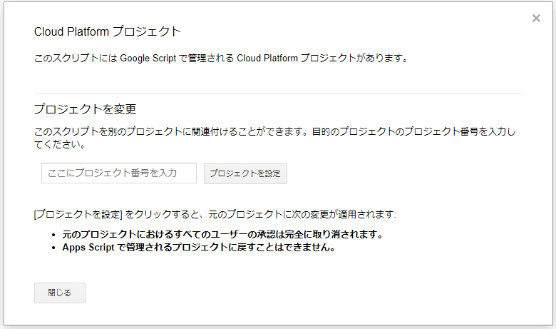
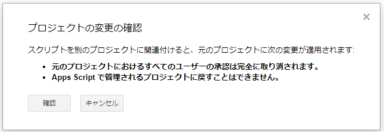

# 使用方法

## 事前準備
### GASエディタ
1. GASでスクリプトエディタを開く
2. 「ファイル」→「スクリプトのプロパティ」の中に表示される「スクリプトID」を控える

### ローカルPC
3. 「git clone　（このリポジトリ）」などで、必要なファイルをダウンロード（※要 git）
4. ルートフォルダに移動して「npm install」を実行。必要なnpmパッケージをインストール（※要node.js）
5. 「2.」のスクリプトIDを「.clasp.json」のscriptId欄に入力

## 使用方法
### 概要
事前準備が終わると「clasp create」をしたときと同等の状態になっています。

「npm run clasp login」と実行して、GASにログインしてください。

srcフォルダ内にプログラムを作成後、「npm run clasp push」で、プログラムをアップロードできます。

# 注意事項・補足
## claspコマンドを実行するときには「npm run」から始める

**claspはローカルインストールされています**。
claspコマンドを実行するときには「npm run clasp ...」というように、 **先頭に「npm run」を付けて」**実行してください。

たとえば、loginしたいときには「npm run clasp login」と実行してください。

## eslintのバージョン

Windows10環境で、「@typescript-eslint/parser」パッケージのバージョンを2.5にすると、eslintに不具合が出るようです（2019/10/27時点）。

そのため、このパッケージのみバージョンを「2.4」で固定しています。

# localログインする場合

「npm run clasp login」を実行する代わりに、下記を実行してください。

## 作業手順
### Google Cloud Platformで、プロジェクトの設定

プロジェクトを設定します（詳細略）。

プロジェクト番号を控えておきましょう。
また、認証用鍵ファイルを作成し「creds.json」という名前で保存してください。

### GASエディタ

1. GASでスクリプトエディタを開く
2. 「リソース」→「Cloud Platform プロジェクト」を開く
3. 下記にGoogle Cloud Platformの画面で取得したプロジェクト番号を入力する

4. 確認画面が表示されるので「確認」をクリック

5. 「Cloud Platform プロジェクト」に戻るので、「閉じる」か、右上の「×」をクリック

### ローカルPC

6. 「npm run clasp login --creds creds.json」を実行する。
7. 画面の指示に従って、権限設定・トークン入力などを行う

